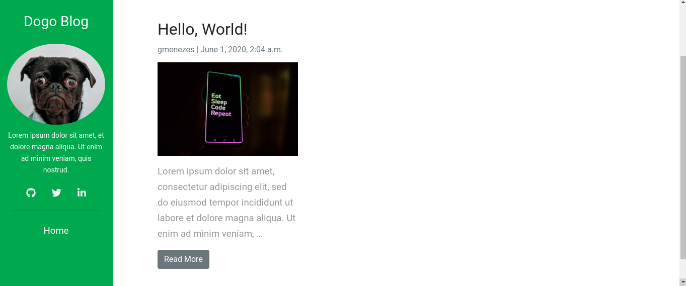

# My Personal Blog

## Description

This application was created in order to register and demonstrate my learnings, thus being able to help other people with the acquired knowledge.

## Usage

### Development

1. Build: `Make build-dev`
2. Run: `run-dev`
3. Create Django admin: `create-admin-dev`
4. Bring the containers down: `stop-dev`

### Production

- TODO

## Reference

- **Django blog tutorial**: https://djangocentral.com/building-a-blog-application-with-django/
- **Docker Compose and Django**: https://docs.docker.com/compose/django/
- **Django for production environment**: https://testdriven.io/blog/dockerizing-django-with-postgres-gunicorn-and-nginx/
- **Django and CK editor plugin**: https://samulinatri.com/blog/django-ckeditor-codesnippet-hightlightjs-youtube/
- **Django Search bar tutorial**: https://learndjango.com/tutorials/django-search-tutorial

## Useful tips

- Generate requirements.txt with pipenv: `pipenv lock --requirements > requirements.txt`
- Container shell: `docker-compose run --rm web /bin/sh`
- Give user permissions to data volume: `sudo chown -R $USER:$USER /home/gmenezes/Documentos/repos/mysite/data/postgres`
- Create Django migrations:
    - `python manage.py makemigrations`
- Run Django migrations:
    - `python manage.py migrate`
    - `docker-compose exec web python manage.py migrate --noinput`
- Collect static files to Django app root: `python manage.py collectstatic`
- Create Django admin user: `docker-compose exec web python manage.py createsuperuser`
- Check postgres inside container:
    - `docker-compose exec db psql --username=postgres --dbname=postgres`
    - `\d`
    - `\l`
    - `\dt`
    - `docker volume inspect mysite_postgres_data`

- Truncate database: `python manage.py flush --no-input`
- Run services on detached mode: `docker-compose up -d --build`
- Delete all docker images: `docker rmi -f $(docker images -a -q)`
- Remove volumes along with containers: `docker-compose down -v`
- Give file permissions: `chmod +x entrypoint.sh`
- Host on development environment: http://localhost:8000/
- Host on production environment: http://localhost:1337/
- Run docker compose specific file: `docker-compose -f docker-compose.prod.yml exec web python manage.py migrate --noinput`

## Image
